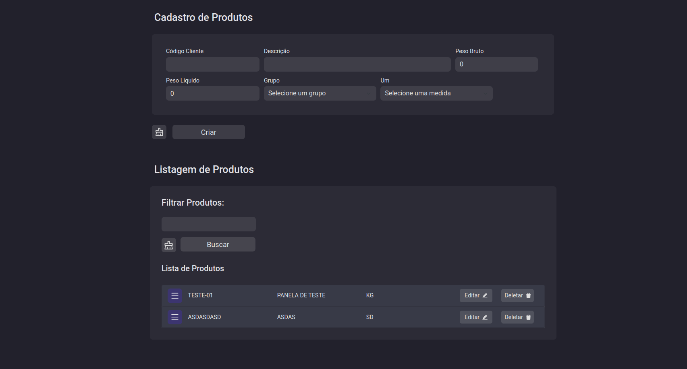

<h1 align="center">
   Teste Front-End | CRUD em lista de usuários
</h1>

<p align="center">
  <a href="#-projeto">Projeto</a>&nbsp;&nbsp;&nbsp;|&nbsp;&nbsp;&nbsp;
  <a href="#-tecnologias">Tecnologias</a>&nbsp;&nbsp;&nbsp;|&nbsp;&nbsp;&nbsp;
  <a href="#-funcionalidades-disponiveis">Funcionalidades Disponiveis</a>&nbsp;&nbsp;&nbsp;|&nbsp;&nbsp;&nbsp;
  <a href="#-como-instalar-o-projeto">Como instalar o projeto?</a>&nbsp;&nbsp;&nbsp;&nbsp;&nbsp;&nbsp;
</p>

## 💻 Projeto

Este projeto propoem um sistema de controle de produtos para usuários, realizando um controle de login, sendo possível adicionar, editar e excluir as informações cadastradas em um banco de dados.

## 🔖 Layout

<h1 align="center">
    
</h1>

<br/>
<br/>

## 🚀 Tecnologias

- [NextJS](https://nodejs.org/en/)
- [ReactJS](https://reactjs.org)
- [Bootstrap React](https://react-bootstrap.github.io/)
- [Typescript](https://www.typescriptlang.org/)
- [Scss](https://sass-lang.com/)
- [Firebase](https://firebase.google.com/)

### 📡 Ferramentas Complementares

- [Eslint](https://eslint.org/)
- [Uuid](https://www.uuidgenerator.net)

<br/>

## ⚙ Funcionalidades Disponiveis

### Regras de negócio

> Usuário:

- Deve realizar o cadastro de um produto onde todos os campos são obrigatórios

- Deve ser realizada a exclusão de um produto

- Deve ser realizada a edição de um produto

- Não deve realizar cadastro se os campos do formulário forem vazios

- Não deve adicionar 2 produtos com o mesmo código de cliente

> Produtos:

- O usuário pode cadastrar um ou mais produtos


### Layout

> Interface 

- Formulário contém botões dinâmicos

- Botões da tabela devem adotar tema de acordo com as propriedades repassadas

- Apresentar um alerta quando uma operação for concluída ou encontrar algum impedimento

## 🤔 Como instalar o projeto?

- Faça um clone desse repositório;
- Acesse um arquivo local desejado através do terminal e digite: 


```sh
git clone https://github.com/ManuelMolina02/firebase-crud-users-products.git
```


Após baixar o projeto, acesse o repositório via terminal e execute os seguintes comandos:

```sh
npm install
npm run dev
```

<br/>
<br/>

Feito com 💜 por Manuel Molina 👋 Me contate através do [LinkedIn!](https://www.linkedin.com/in/manuel-angel-berger-molina-ba08b3174/)
